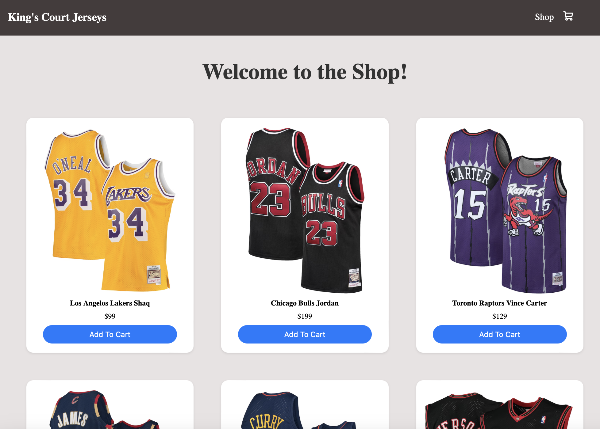

# King's Court Jerseys E-commerce Website

## Introduction
Welcome to the GitHub repository of King's Court Jerseys, an e-commerce platform dedicated to offering a wide range of basketball jerseys. Designed with basketball fans in mind, our website provides an easy and enjoyable shopping experience, enabling fans to find and purchase their favorite team's jerseys with ease.

## Features
- **Wide Selection of Jerseys**: From vintage classics to the latest season, find jerseys of your favorite teams and players.
- **User-Friendly Interface**: Our intuitive design ensures you can easily navigate through our catalog and find what you're looking for.
- **Shopping Cart**: Add items to your cart, adjust quantities, or remove them as you refine your selection before purchase.
- **Secure Checkout**: Complete your purchase with our secure checkout process, supporting multiple payment methods.
- **Responsive Design**: Enjoy a seamless shopping experience on any device, whether on desktop, tablet, or mobile.

## Technology Stack
This project is built with the following technologies:
- **React.js**: For building a dynamic, single-page application with a component-based architecture.
- **HTML5**: For structuring the content of our web pages.
- **CSS3**: For styling and creating a responsive design layout.
- **React Router**: For enabling navigation between different sections of our application without refreshing the page.

## Local Setup
To run this project locally on your machine, follow the steps below:

**Clone the repository**
git clone https://github.com/kaarishp/king-court-jerseys.git
cd e-commerce
npm install
npm start

## Acknowledgments
A huge thank you to everyone who takes the time to look at, use, or contribute to King's Court Jerseys. Your interest and support fuel continuous improvement and feature development. We're excited to share our passion for basketball and technology with you and look forward to your feedback and contributions.

Thank you for visiting our project!

